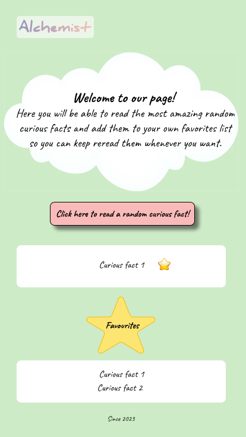

# Project Name: Curious Facts
_Proposal_
The Useless Facts company wants to develop the front-end part of an application that returns curious facts that nobody cares about, the idea is that within the main page, we can see each curious fact that the https://uselessfacts API returns. jsph.pl/ and if we like a curious fact, we can save it within a favorite space on the same main page.

---
## Table of Contents

1. [Facility](#Facility)

        *[Pasos para la instalación](#pasos-para-instalación)
2. [How it works](#How-it-works)
3. [Figma](#recursos-figma)
        *[Figma version mobile]

---

# Facility:
    To install the project, you must clone the repository with the following link:

---
## How it works
    Upon entering the page, you will be able to see randomly selected curious facts, by clicking the button.
In case one of them has been interesting to you, you can select it by clicking the star that appears next to the text and that way it would be kept in the list of favorites.

---

# Mockup

---

### Technologies

 

 

---

### Tools

 

---

### Developers

        Denise Khurlopian.
        Leandra Bujhamer.